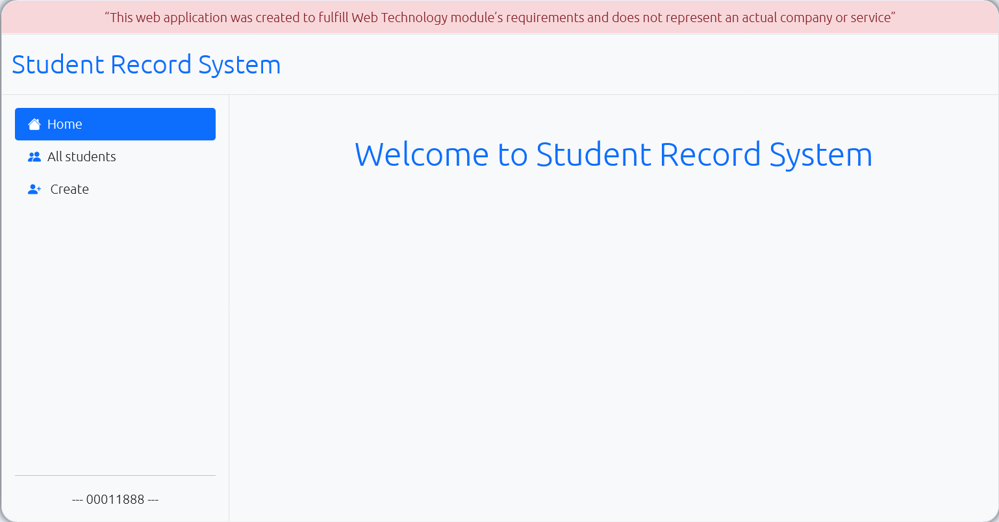

# Student Record System

Student Record System is the application for recording students's data. The application build
with node.js and express.js. The user interface is designed simply and easy to understand.



## Features

- Create new record and save it in database
- Update existing data
- Delete data from database
- Search students from database

## Dependencies

#### The application uses a number of open source projects to work properly:

- Node.js - An open-source, cross-platform, back-end JavaScript runtime environment
- Express - fast node.js network app framework
- express-validator - Validating user input
- Pug.js - Building UI for application
- sqlite3 - Database engine for storing data
- sequelize - Node.js based ORM (Object-relational mapping)

## Installation

Student Record System application requires [Node.js](https://nodejs.org/) v10+ to run.

Download or clone the project and install the dependencies and start the server.
Then run this command in terminal one by one.

```sh
git clone https://github.com/student11888/WebTech_CW_2.git
npm i
node app
```

Your app should now be running on localhost:3333.

[Source Code](https://github.com/student11888/WebTech_CW_2)

## Project Structure

```sh
project
|
└───controllers
│   │   homeController.js
│   │   searchController.js
|   |   studentsController.js
|
|___public
|   │
|   │___js
|   |   |   script.js
|   |
|   |___styles
|   |   |   style.css
|   |
|   |   Preview.png
|
|___routes
|   |   homeRoute.js
|   |   studentsRoute.js
|
|___views
|   |
|   |___includes
|   |   |   legal.pug
|   |
|   |   add.pug
|   |   all-students.pug
|   |   base.pug
|   |   home.pug
|
|___.gitignore
|___app.js
|___database.js
|___db.sqlite3
|___model.js
|___package-lock.json
|___package.json
|___Readme.md
```

## Deployment

Want to see live demo feel free to visit - [Demo](https://knowing-proximal-water.glitch.me/)

Demo is deployed in [Glitch](https://glitch.com/)

<!-- tree generated by markdown-notes-tree starts here -->
